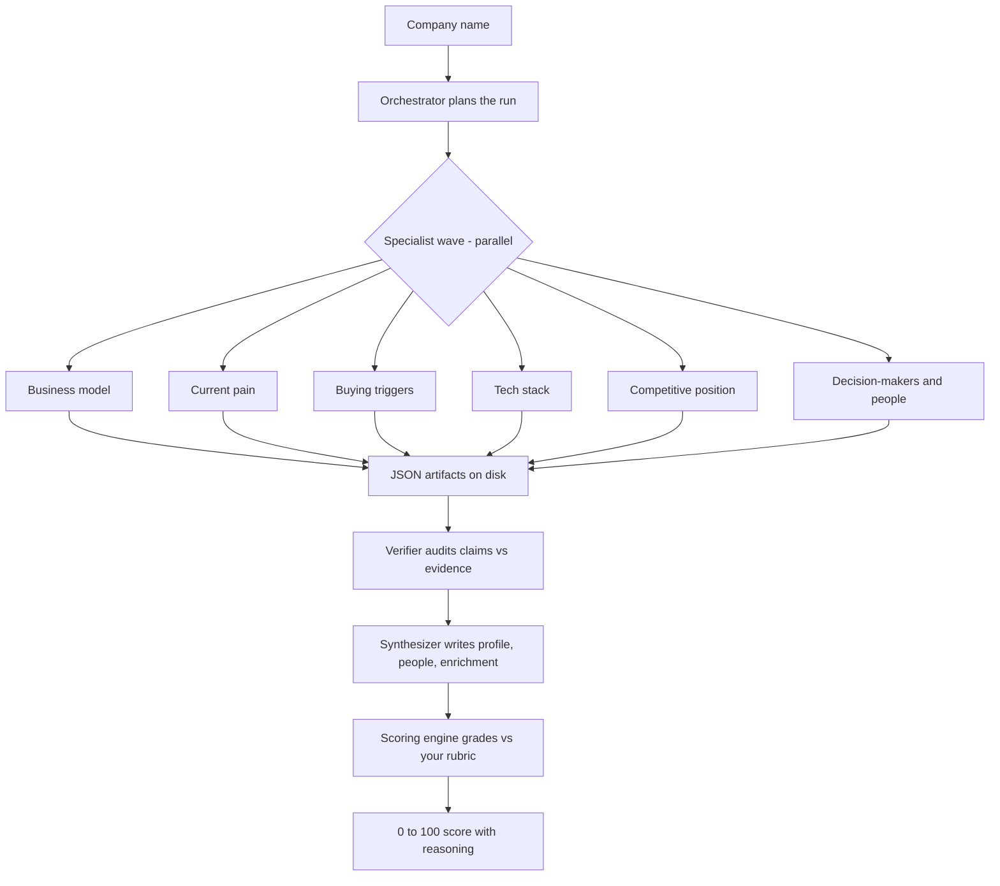
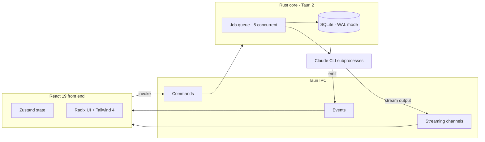

<div align="center">

# Augur OS

### Augur reads the signals. You close the deal.

A local-first lead-intelligence workspace that turns a cold company name into a fully researched, evidence-backed, scored opportunity in minutes.

<br/>

[](LICENSE)
[](https://github.com/DivyamTalwar/Augur/stargazers)
[](https://tauri.app)
[](https://www.rust-lang.org)
[](https://react.dev)

</div>

<br/>

<div align="center">

### Watch the launch film

[](https://github.com/DivyamTalwar/Augur/releases/download/v0.2.1/augur-film.mp4)

**[▶  Watch the full 3-minute film](https://github.com/DivyamTalwar/Augur/releases/download/v0.2.1/augur-film.mp4)**

</div>

<br/>

## Contents

- [What is Augur OS](#what-is-augur-os)
- [The problem](#the-problem)
- [Features](#features)
- [Who it is for](#who-it-is-for)
- [Product tour](#product-tour)
- [How it works](#how-it-works)
- [Architecture](#architecture)
- [Project structure](#project-structure)
- [Tech stack](#tech-stack)
- [Getting started](#getting-started)
- [FAQ](#faq)
- [Contributing](#contributing)
- [Security](#security)
- [License](#license)

## What is Augur OS

Augur OS is a desktop application for B2B account research and signal-based lead scoring. You give it a list of companies. For each one it runs a deep, multi-stage research pipeline, scores the account against your own ideal-customer rubric, maps the real buying committee, and drafts outreach grounded in cited evidence. Work that used to take an afternoon per account finishes in minutes.

What sets it apart is discipline. Augur does not just generate a plausible-sounding summary. A dedicated verification stage audits every claim against the source it came from and drops anything it cannot support, so the profiles you read are grounded in evidence you can open and check yourself.

Augur runs as a native desktop app built with React 19, TypeScript, Tauri 2, Rust, and SQLite. Your research, your scores, and your pipeline live in a local database on your own machine. Nothing is uploaded to an Augur server, because there is no Augur server.

## The problem

Outbound teams spend more time researching accounts than selling to them, and they still walk into conversations half-blind.

The research itself is slow and repetitive. A rep opens a dozen browser tabs, skims the company website, scans recent news, guesses at who sits on the buying committee, and tries to find a reason the deal is urgent right now. An hour later they have a thin set of notes and no real confidence in them.

The output is also hard to trust. Generic AI summaries read well but quietly invent facts, average away contradictions, and cite nothing. A confident sentence with no source behind it is a liability in a sales conversation, not an asset.

And the prioritization is guesswork. Without a consistent way to score accounts, reps work the names at the top of the list instead of the names most likely to close.

Augur OS attacks all three problems at once: it does the research fast, it grounds every finding in a checkable source, and it scores each account against a rubric you define so your team works the right deals in the right order.

## Features

- **Deep company research.** For every account Augur works out the business model, what the company sells, how it makes money, who buys from it, where it is feeling operational pain, recent buying triggers, the technology stack, and competitive position. Each angle is researched in genuine depth rather than reduced to a single line.

- **Evidence for every claim.** A dedicated verifier stage reviews every finding the research agents produce, checks it against the source URL and quote behind it, weighs confidence and freshness, and rejects anything unsupported, stale, or contradicted. Unsupported claims never reach the final profile. What you read is what the evidence supports.

- **Signal-based lead scoring.** Define your ideal customer once as a rubric. Augur grades every company from 0 to 100 against that rubric and shows the full reasoning behind the number, so the score is something you can defend in a pipeline review rather than a black box.

- **Buying-committee discovery.** Augur finds the people who actually matter at each target, with their roles and the context for why each one is worth reaching, instead of dumping a flat list of names.

- **Grounded outreach drafts.** Augur turns the research into a concrete outreach strategy for the account. Because the strategy is written from the same cited findings, every message is specific to that company rather than a generic template.

- **Live-streaming progress.** Watch the research happen in real time. As each agent works, its progress streams into the app so you can see exactly what is being investigated and follow the run as it unfolds.

- **Local-first by design.** Every lead, person, score, and prompt is stored in a SQLite database on your machine. Your pipeline is yours, and it works the same whether or not you are online when you read it.

## Who it is for

- **Outbound and SDR teams** that need to research and prioritize a large list of accounts without burning a day per company.
- **Account executives** preparing for discovery calls who want a defensible account brief, a mapped buying committee, and a clear reason the deal is timely.
- **Founders running their own outbound** who do not have a research team and need to punch above their weight on every account.
- **RevOps and sales leaders** who want a consistent, rubric-driven scoring model so the team works the same definition of a good-fit account.
- **Anyone who values local-first software** and wants their prospect research to stay on their own machine.

## Product tour

<div align="center">


**Your pipeline at a glance.** Every company, its research status, and its score in one workspace.

<br/>


**A research profile, written for you.** Each account gets a TL;DR and a full profile distilled from the run.

<br/>


**Evidence behind every claim.** Cited sources back each finding, so you can trust what is in the profile.

<br/>


**The buying committee, mapped.** See who to reach at the account and why each person matters.

<br/>


**Outreach, drafted from the research.** A concrete strategy for the account, grounded in what Augur found.

<br/>


**A score you can defend.** Every company graded against your rubric, with the full reasoning shown.

</div>

## How it works

Augur runs each company through a multi-stage research pipeline. The pipeline is built around a simple principle: many specialists research in parallel, an auditor checks their work, and only verified findings make it into the final profile.

### The orchestrator

When a research job starts, an orchestrator plans the run. It picks the right roster of specialist agents for the chosen research depth, sets up an isolated workspace on disk for the job, and coordinates the agents in ordered waves. Independent specialists in the same wave run in parallel; later waves do not begin until the artifacts from the previous wave are written to disk.

### The specialist wave

Each specialist owns exactly one research angle and writes its findings as a strict JSON artifact:

- **Pain diagnostician** finds public evidence of operational friction, costly problems, and buying urgency.
- **Business-model strategist** works out what the company sells, how it makes money, and who buys from it.
- **Trigger-signal analyst** surfaces recent events that make a deal timely, such as funding, launches, hiring, or leadership changes.
- **Tech-stack analyst** identifies the technologies the company runs.
- **Competitive-position analyst** maps where the company sits against its rivals. This specialist joins on deeper runs.
- **People finder** identifies the buying committee, with roles and outreach context.

Every specialist is told to prefer primary sources, attach an evidence URL to each non-obvious claim, and never invent a finding. If the evidence is weak, the specialist lowers its confidence or returns nothing rather than guessing.

### The verifier

The verifier is the integrity check. It reads every specialist artifact and audits each claim: does it have a credible evidence URL, is the confidence defensible, is the date fresh enough, and do any specialists contradict each other? Claims that are unsupported, stale, contradicted, or too speculative are rejected. Conflicts are preserved rather than averaged away. The verifier is authoritative: its verdict on every claim is final, and the next stage must respect it.

### The synthesizer

The synthesizer writes the final output. It reads the verified findings, applies a strict conflict hierarchy (verifier verdict first, then higher confidence, then fresher source, and otherwise drop the claim), and produces three artifacts: a structured `company_profile.md` with a TL;DR and sections covering what the company sells, how it makes money, who buys, current pain, recent triggers, tech stack, competitive posture, and a decision-maker map; a `people.json` file describing the buying committee; and an `enrichment.json` file of verified company fields. Claims in the profile are cited inline back to the specialist that produced them.

### Scoring

Scoring is a separate, deterministic step. You define your ideal customer once as a rubric. The scoring engine grades the researched company against that rubric, returns a 0 to 100 score, and shows the reasoning behind it. Because scoring runs against your own criteria, the number reflects your definition of a good account, not a generic notion of company quality.



### Research depth

Each run has a depth setting that controls how thorough it is.

- **Light** runs a single-pass research session and skips the orchestrated specialist waves.
- **Standard** orchestrates five specialists, then a verifier, then a synthesizer.
- **Deep** expands the wave to add the competitive-position analyst and a buyer-profile synthesizer, runs the verifier across all prior outputs, and finishes with the synthesizer.

Deeper runs allow more time per job and produce a richer profile; lighter runs finish faster. You pick the trade-off per run.

## Architecture

Augur OS is a Tauri 2 desktop application. A React front end talks to a Rust core over Tauri's IPC layer. The core manages a concurrent job queue, persists everything to SQLite, streams progress back to the UI, and spawns research subprocesses to do the work.



### React front end

The interface is built with React 19, TypeScript, Vite, and Tailwind CSS 4, using Radix UI primitives for accessible components. Application state lives in Zustand stores with Immer, and entities are kept in normalized `Map` collections keyed by id for fast lookups and updates. The stream panel keeps job logs in its own store so live research output survives navigation between views.

### Tauri IPC layer

The front end and the Rust core communicate over Tauri's IPC bridge. There are three channels of communication: the UI calls backend commands with `invoke`; the backend pushes streaming channels carrying live job output as it is produced; and the backend emits events such as `lead-updated` and `person-updated` that the front end listens for to refresh its cached data reactively.

### Rust core

The core is written in Rust on Tauri 2. It owns the database, the job lifecycle, event emission, and the research subprocesses. Command handlers cover lead, person, and score CRUD, research and scoring job management, and prompt storage.

### Job queue

Research and scoring jobs run through an async job queue that allows up to five jobs at once, gated by a semaphore. Each job runs with a depth-dependent timeout. The queue handles spawning subprocesses, streaming their output, parsing results, and recovering cleanly if a job fails.

### Storage

All persistent data lives in a local SQLite database running in WAL mode, accessed through `rusqlite`. It holds leads, people, prompts, scoring configuration, and lead scores. The database file lives under your local application data directory.

### Research subprocesses

The research engine runs as Claude CLI subprocesses spawned by the job queue. Each research job gets its own isolated workspace directory containing the specialist agent definitions and an `outputs` folder. Specialists write their JSON artifacts and stream logs into that workspace; the core reads the results back and persists them. Workspaces are cleaned up when the job finishes.

## Project structure

```
src/                          # React front end
├── pages/                    # Page components (list, detail, scoring, prompt)
├── components/
│   ├── ui/                   # Radix-wrapped primitives (Button, Dialog, etc.)
│   ├── leads/, people/       # Feature-specific components
│   └── stream-panel/         # Real-time job output display
└── lib/
    ├── store/                # Zustand stores
    ├── tauri/                # Backend integration (commands, event bridge)
    └── hooks/                # Data fetching hooks

src-tauri/src/                # Rust backend
├── commands/                 # Tauri command handlers
│   ├── database.rs           # Lead/Person/Score CRUD
│   ├── research.rs           # Job management (research, scoring)
│   └── prompts.rs            # Prompt storage
├── db/                       # SQLite schema and queries
├── jobs/                     # Async job queue
├── prompts/                  # Specialist and default prompt templates
├── orchestration.rs          # Research depth, waves, workspace setup
└── events.rs                 # Event emission to the front end
```

## Tech stack

| Layer | Technology |
| --- | --- |
| Front end | React 19, TypeScript, Vite, Tailwind CSS 4 |
| State and UI | Zustand, Immer, Radix UI |
| Core | Rust, Tauri 2 |
| Storage | SQLite (WAL mode) via rusqlite |
| Toolchain | Bun |
| Research engine | Claude CLI |

## Getting started

### Prerequisites

Before you build Augur OS, install the following:

- **[Bun](https://bun.sh)** — the package manager and script runner for the front end.
- **[Rust](https://www.rust-lang.org/tools/install)** — the stable toolchain, used to build the Tauri core.
- **[Claude CLI](https://claude.ai/code)** — the research engine, with API access configured.
- **Platform build dependencies for Tauri 2** — system libraries vary by operating system. Follow the [Tauri prerequisites guide](https://tauri.app/start/prerequisites/) for macOS, Windows, or Linux before your first build.

Confirm the Claude CLI runs from your terminal before starting Augur, since the research pipeline spawns it directly.

### Run it

```bash
git clone https://github.com/DivyamTalwar/Augur.git
cd Augur
bun install
bun run tauri:dev
```

`bun run tauri:dev` starts the Vite dev server and the Tauri shell together with hot reload. The first run compiles the Rust core and can take a few minutes; later runs are fast.

### Build for production

```bash
bun run tauri:build
```

This produces a native installer for your platform.

### Useful commands

```bash
bun run dev            # front end only (Vite dev server)
bun run lint           # lint
bun run lint:fix       # lint and autofix
bun run format         # format with Prettier
tsc -b                 # type-check
```

## FAQ

**Where is my data stored?**
In a local SQLite database in your operating system's application data directory. Augur OS is local-first. There is no Augur server and nothing is uploaded.

**Do I need an internet connection?**
You need one while a research job is running, because the research agents fetch public web sources. Reading existing profiles, scores, and people works fully offline.

**What does it cost to run?**
Augur OS itself is free and open source under Apache 2.0. The research engine runs through the Claude CLI, so you pay for that usage under your own API access.

**Can I customize what the research looks for?**
Yes. The prompt templates that drive research and scoring are part of the project, and you define your scoring rubric in the app to match your ideal customer.

**How accurate is the research?**
Every non-obvious claim is tied to an evidence source, and the verifier stage rejects claims it cannot support. Profiles surface their citations and any unresolved claims, so you can check the evidence yourself rather than trusting the output blindly.

**Which platforms are supported?**
Augur OS builds as a native desktop app via Tauri 2. It can be built for macOS, Windows, and Linux, subject to the Tauri platform prerequisites.

## Contributing

Contributions are welcome. Bug reports, feature requests, and pull requests all help. For anything large, open an issue first so we can agree on the approach. Every pull request is reviewed by a maintainer before merge.

Start with [CONTRIBUTING.md](CONTRIBUTING.md) for local setup, branching, and commit conventions.

## Security

Found a vulnerability? Please report it privately. See [SECURITY.md](SECURITY.md).

## License

Augur OS is released under the [Apache License 2.0](LICENSE). Copyright 10XU Inc.

<br/>

<div align="center">

**Augur reads the signals. You close the deal.**

Built by 10XU Inc.

</div>
