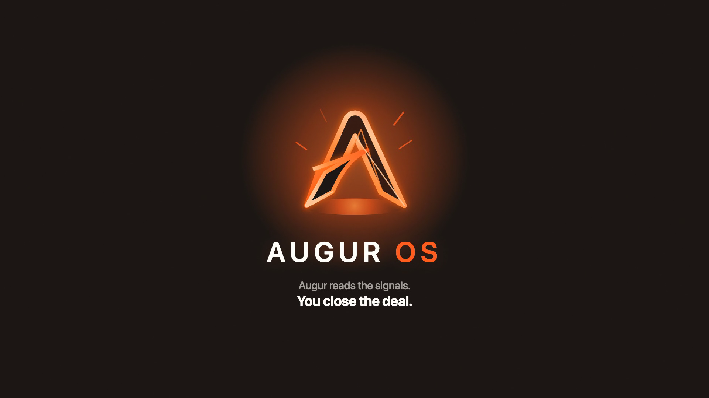
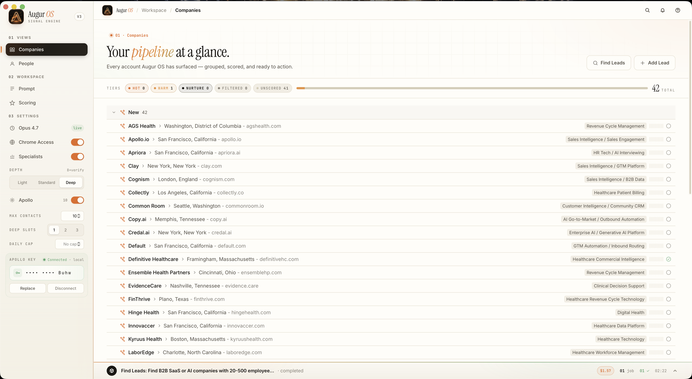
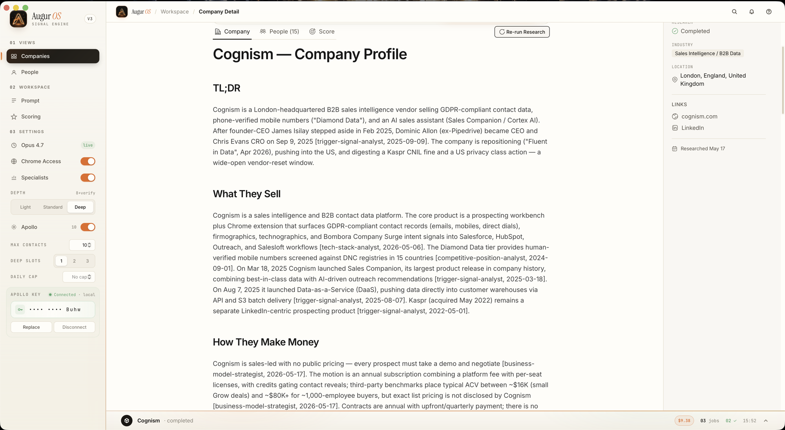
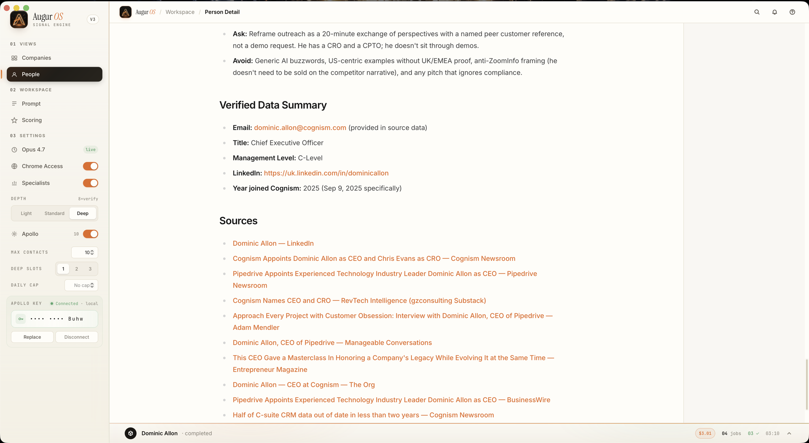
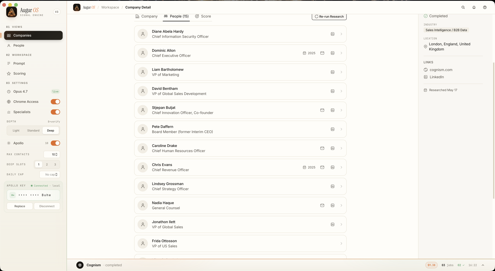
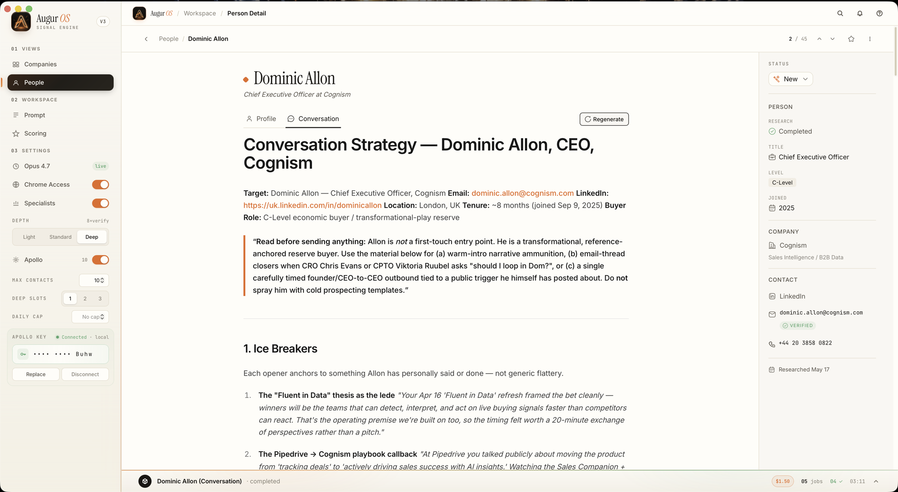
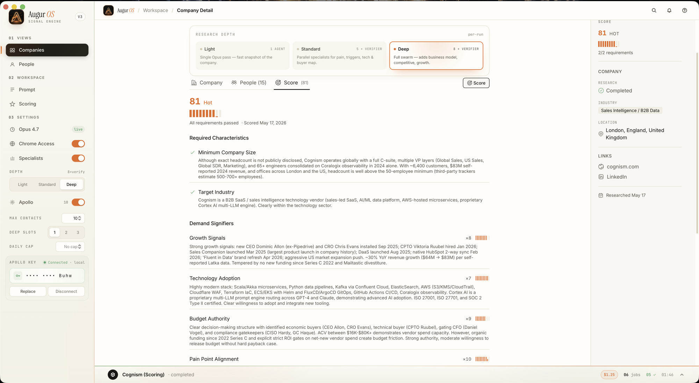
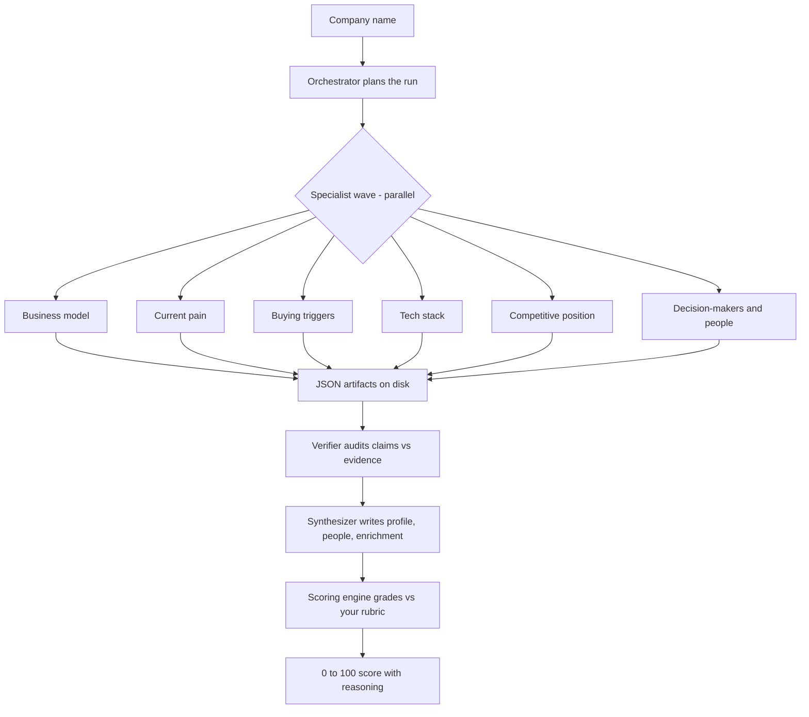
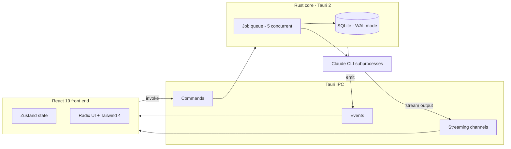

<div align="center">


<br/>
<br/>

### Augur reads the signals. You close the deal.

A lead-intelligence workspace that turns a cold company name into a fully-researched, scored, ready-to-close opportunity in minutes.

<br/>

[](LICENSE)
[](https://github.com/DivyamTalwar/Augur/stargazers)
[](https://tauri.app)
[](https://www.rust-lang.org)
[](https://react.dev)

</div>

<br/>

<div align="center">

### Watch the 3-minute launch film

<video src="https://github.com/DivyamTalwar/Augur/releases/download/v0.2.1/augur-film.mp4" poster=".github/assets/launch-film-poster.png" width="720" controls>
  <a href="https://github.com/DivyamTalwar/Augur/releases/download/v0.2.1/augur-film.mp4"></a>
</video>

[Open the film in a new tab](https://github.com/DivyamTalwar/Augur/releases/download/v0.2.1/augur-film.mp4)

</div>

<br/>

## What is Augur OS

Outbound reps burn hours researching accounts and still walk in half-blind. They guess at the buying committee, miss the trigger that makes the deal urgent, and write outreach that reads like everyone else's.

Augur OS closes that gap. Give it a list of companies. It runs deep AI research on each one, scores it against your ideal-customer rubric, maps the real buying committee, and drafts outreach grounded in cited evidence. The work that used to take an afternoon per account finishes in minutes, and every claim comes with a source you can check.

It is a desktop application, built with React 19, TypeScript, Tauri 2, Rust, and SQLite. Your data stays local.

## Features

- **Deep company research.** Business model, products, current pain, buying triggers, tech stack, and competitive position, worked out in depth for every account.
- **Signal-based lead scoring.** Define your ideal customer once. Augur scores every company 0 to 100 against your custom rubric and explains the reasoning.
- **Buying-committee discovery.** Finds the people who matter at each target, with roles and outreach context, not just a list of names.
- **Evidence for every claim.** A verifier audits each finding against its source and drops anything it cannot support. No hallucinated facts in your pipeline.
- **Grounded outreach drafts.** Outreach strategy written from the research itself, so every message is specific to the account.
- **Live-streaming progress.** Watch the research happen in real time, agent by agent, as the run unfolds.

## Product tour

<div align="center">



**Your pipeline at a glance.** Every company, its research status, and its score in one workspace.

<br/>



**A research profile, written for you.** Each account gets a TL;DR and a full profile distilled from the run.

<br/>



**Evidence behind every claim.** Cited sources back each finding, so you can trust what is in the profile.

<br/>



**The buying committee, mapped.** See who to reach at the account and why each person matters.

<br/>



**Outreach, drafted from the research.** A concrete strategy for the account, grounded in what Augur found.

<br/>



**A score you can defend.** Every company graded against your rubric, with the full reasoning shown.

</div>

## How it works

Augur runs a multi-stage research pipeline for each company. An orchestrator plans the run. A wave of specialist agents each researches one angle in parallel, writing a JSON artifact to disk. A verifier audits every claim against its evidence and drops what it cannot support. A synthesizer assembles the final profile, and the scoring engine grades the company against your rubric.



The specialist roster scales with research depth. Standard runs use five specialists plus a verifier and synthesizer. Deep runs add a competitive-position analyst and a buyer-profile synthesizer, expanding the wave to eight agents working a single account. The verifier is authoritative: it accepts or rejects each claim and never lets unsupported evidence reach the final files.

## Architecture

A React 19 front end talks to a Rust core over Tauri IPC. The core runs a concurrent job queue, persists everything to SQLite, emits events back to the UI, and spawns Claude CLI subprocesses to do the research and scoring.



The job queue runs up to five jobs at once with a per-job timeout. Research output streams to the front end through Tauri channels as it is produced. Results are parsed and written to SQLite on completion, and the UI updates reactively through Tauri events.

## Tech stack

| Layer | Technology |
| --- | --- |
| Front end | React 19, TypeScript, Vite, Tailwind CSS 4 |
| State and UI | Zustand, Radix UI |
| Core | Rust, Tauri 2 |
| Storage | SQLite (WAL mode) |
| Toolchain | Bun |
| Research engine | Claude CLI |

## Getting started

### Prerequisites

- [Bun](https://bun.sh)
- [Rust](https://www.rust-lang.org/tools/install) (stable toolchain)
- [Claude CLI](https://claude.ai/code) with API access
- Platform build dependencies for Tauri 2: see the [Tauri prerequisites guide](https://tauri.app/start/prerequisites/)

### Run it

```bash
git clone https://github.com/DivyamTalwar/Augur.git
cd Augur
bun install
bun run tauri:dev
```

`bun run tauri:dev` starts Vite and the Tauri shell together with hot reload.

### Build for production

```bash
bun run tauri:build
```

This produces a native installer for your platform.

## Contributing

Contributions are welcome. Bug reports, feature requests, and pull requests all help. For anything large, open an issue first so we can agree on the approach. Every pull request is reviewed by a maintainer before merge.

Start with [CONTRIBUTING.md](CONTRIBUTING.md) for local setup, branching, and commit conventions.

## Security

Found a vulnerability? Please report it privately. See [SECURITY.md](SECURITY.md).

## License

Augur OS is released under the [Apache License 2.0](LICENSE). Copyright 10XU Inc.

<br/>

<div align="center">

**Augur reads the signals. You close the deal.**

Built by 10XU Inc.

</div>
