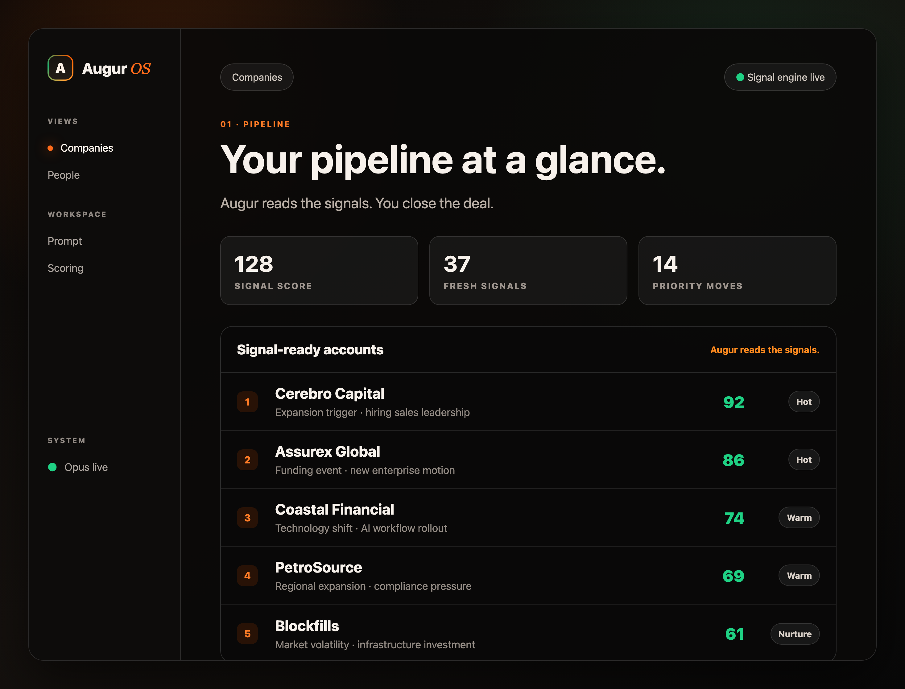
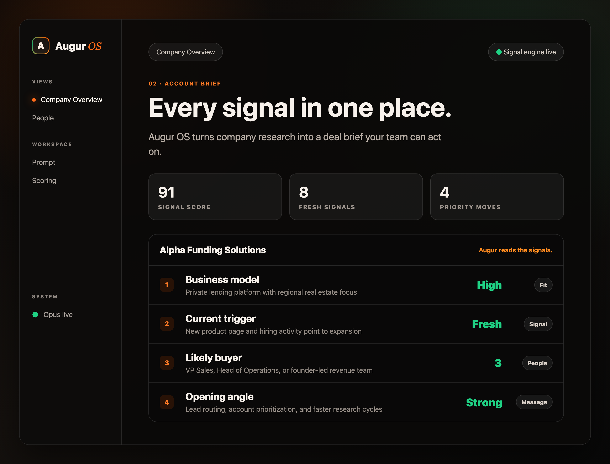
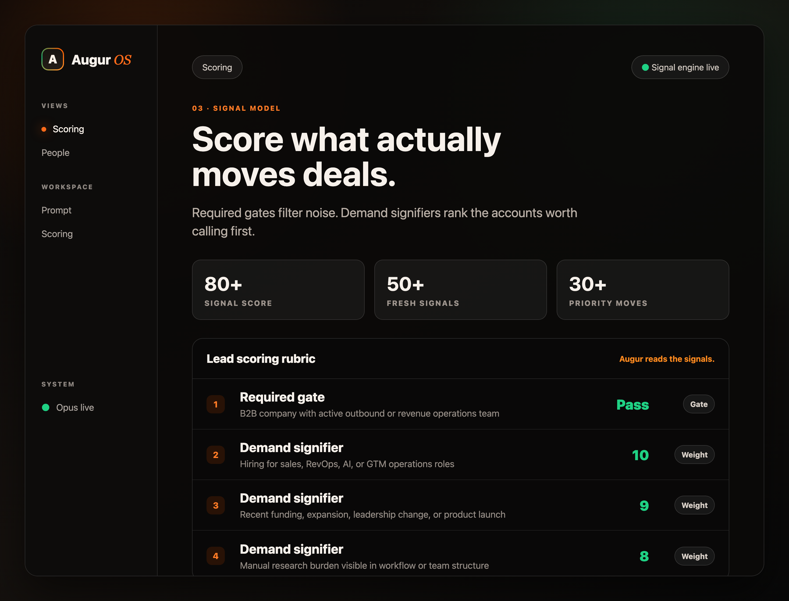

<div align="center">


<br/>
<br/>

**Augur reads the signals. You close the deal.**

[](https://github.com/DivyamTalwar/Augur/stargazers)
[](https://twitter.com/intent/tweet?text=Check%20out%20Augur%20OS%20-%20Augur%20reads%20the%20signals.%20You%20close%20the%20deal.&url=https://github.com/DivyamTalwar/Augur)

</div>

## Quick Start

```bash
# Prerequisites: Bun, Rust, and Claude CLI
git clone https://github.com/DivyamTalwar/Augur.git
cd Augur
bun install
bun run tauri:dev
```

Requires [Bun](https://bun.sh), [Rust](https://rustup.rs), and [Claude CLI](https://claude.ai/code) with API access.

## Augur OS

Augur OS is a lead intelligence workspace for outbound teams. It researches companies, scores buying signals, finds relevant contacts, and gives reps the context they need to act with confidence.



## What It Does

Augur OS takes a list of companies and handles the research work:

- **Deep company research** - Pulls company information, business model, products, employee count, funding, and more
- **Signal-based scoring** - Scores leads against your custom criteria, including industry, size, growth signals, and urgency indicators
- **Contact discovery** - Finds relevant people at each company with roles and outreach context
- **Real-time streaming** - Shows research progress live as Claude investigates each lead



## Lead Scoring

Define your ideal customer profile and let Augur OS score every lead automatically:

- Required characteristics such as industry, size, and location
- Demand signifiers such as technology adoption and recent changes
- Growth signals such as funding, hiring, and expansion
- Urgency indicators such as contract renewals and pain points

Each lead gets a score from 0-100 with detailed reasoning you can review.



## Build for Production

```bash
bun run tauri:build
```

## License

MIT
